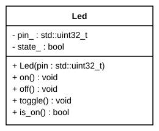

# Exercise Session 6, Homework

Do these after Exercises 1-3, in [`instructions.md`](instructions.md). Write answers in the
`_Answer:_` blocks. Commit this file, your `.png` files and your `.cpp` file.

Both exercises use the UML class and object diagrams from the lecture. Draw them by hand:

Open [app.diagrams.net](https://app.diagrams.net) In the left panel, search the shapes for `class` and `object`, or open
**More Shapes** and tick **UML**.

---

## Exercise 4: Draw your classes and objects

**Goal:** Draw a class diagram of the classes from Exercise 3, and an object diagram of
the objects `main()` creates.

### Instructions

1. Start a new blank diagram. Draw `PwmLed`, `Potentiometer` and `Application` as
   class boxes. Copy the members from the headers in Exercise 3.
2. Write each class name with its namespace: `hw::PwmLed`, `app::Application`.
   Underline `MAX_LEVEL` and `MAX_VALUE`: they are `static`.
3. Draw an arrow from `Application` to each class it uses, labelled `uses`.
4. Add a second page (the **+** at the bottom). Draw an object box for each object in
   `main()` of `dimmer_multi.cpp`: `led`, `pot` and `application`. Fill in the values right
   after the constructors ran. Draw a link from `application` to each object it refers to.
5. Export each page as a PNG: **File** → **Export as** → **PNG**. Name them
   `dimmer_classes.png` and `dimmer_objects.png`.

### Checklist

- [x] Three classes, with all members, `+`/`-` and types
- [x] `MAX_LEVEL` and `MAX_VALUE` underlined
- [x] Namespaces `hw` and `app` in the class names; two arrows from `Application`
- [x] Three objects, names underlined, with values; two links from `application`
- [x] Both `.png` committed

**Why does `PwmLed` have no arrow to `Potentiometer`?**

> _Answer: Because PwmLed only controls the LED brightness and doesn't need to know anything about the potentiometer. The Application class connects them by reading the potentiometer and setting the LED brightness._
>

**Why are `MAX_LEVEL` and `MAX_VALUE` not in the object diagram?**

> _Answer: Because they are static members, meaning they belong to the class itself and are shared by all objects. The object diagram only shows the values stored in each individual object._
>

**Attached file(s):**

> _Filename: ex4.png_
>

*Read more (optional): Beginning C++17, Chapter 11 ("Static Members of a Class").
Real-Time C++, Sect. 4.7 ("Class Relationships"), pp. 72-74: is-a, has-a and uses-a.*

---

## Exercise 5: From diagram to class

**Goal:** Implement a C++ class from its class diagram.

This is the class diagram:

`state_` is `true` while the LED is on. The constructor sets up the pin as an output, with
the LED off. `toggle()` switches the LED: on becomes off, off becomes on.

### Instructions

1. Create a project `led_class`. Copy in [`code/led_class.cpp`](code/led_class.cpp).
2. Fill in TODO 1. Use a member initializer list. Mark the constructor `explicit`: it has
   one parameter. The constructor sets up the pin with `gpio_init()` and `gpio_set_dir()`,
   like in Session 3. `gpio_put()` switches the LED.
3. Fill in TODO 2 and 3. Open the Serial Monitor, build and run. The LED switches on or
   off every second.

### Checklist

- [ ] Every member from the diagram, with the right `+`/`-`
- [ ] `is_on()` is `const`; the constructor is `explicit`
- [ ] The LED blinks; the Serial Monitor shows `on` and `off`

**What does `explicit` stop? Write one line it would make fail.**

> _Answer:_
>

**Attached file(s):**

> _Filename:_
>

---

*Read more (optional): Beginning C++17, Chapter 11 ("Using the explicit Keyword",
"const Objects and const Member Functions").*
